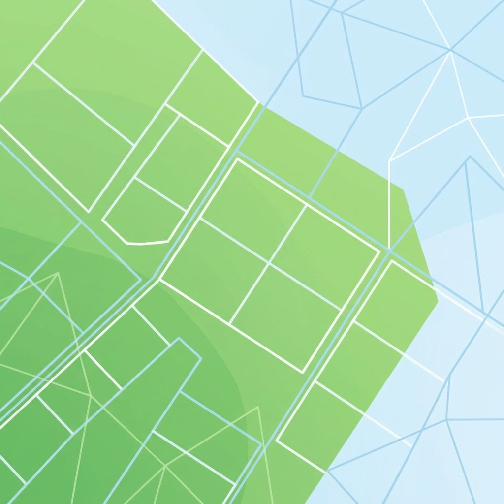

# Le Petit Cadastre 🗺️



**Objectif :** Créer une application de visualisation de parcelles cadastrales.

## 🛠 Stack Technique

-   **Vue.js 3** (Composition API)
-   **Vite**
-   **Leaflet** (via `@vue-leaflet/vue-leaflet` ou direct)

---

## 📅 Programme du TP

Nous avons découpé l'apprentissage en 4 niveaux de difficulté croissante.

### 1. Niveau Débutant : Afficher la carte 🌍
**But :** Initialiser un projet Vue et afficher une carte centrée sur sa ville.

-   **Notions Vue :** `npm create vue@latest`, composants de base, gestion du CSS.
-   **Librairie conseillée :** `@vue-leaflet/vue-leaflet`.

### 2. Niveau Intermédiaire : Les Parcelles (Polygones) 🟩
**But :** Au lieu de simples points, dessiner des polygones pour délimiter les terrains.

-   **Tâche :** Dessiner 2 ou 3 rectangles/formes sur la carte.
-   **Notions Vue :** Tableaux d'objets (`data`), boucle `v-for`.

### 3. Niveau Avancé : Interactivité & Données (GeoJSON) 🖱️
**But :** Simuler des données réelles et ajouter de l'interactivité.

-   **Tâche :** Au clic sur une parcelle, afficher une fiche latérale avec les détails (Nom, Surface, Type).
-   **Notions Vue :** Events (click), Props, Ref.

### 4. Niveau "Pro" : Filtrage 🔍
**But :** Ajouter des outils de filtrage et de visualisation dynamique.

-   **Tâche :** Barre de recherche, coloration par statut (Vendu/A vendre).
-   **Notions Vue :** Computed Properties, `v-model`.

---

## 🚀 Installation

```sh
# Installer les dépendances
npm install

# Lancer le serveur de développement
npm run dev
```
