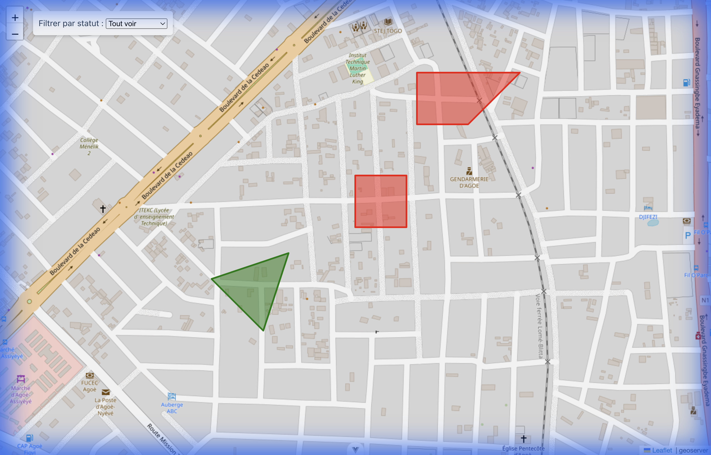

# Guide du Code - Le Petit Cadastre 🗺️

Ce document explique en détail chaque partie du code de l'application.



---

## Structure du Projet

```
src/
├── App.vue                    # Composant racine (conteneur principal)
├── main.js                    # Point d'entrée de l'application
├── assets/
│   ├── base.css               # Variables CSS et styles de base
│   └── main.css               # Styles globaux
├── components/
│   └── ParcelDetail.vue       # Composant pour afficher les détails d'une parcelle
├── views/
│   └── HomeView.vue           # Vue principale avec la carte
└── router/
    └── index.js               # Configuration des routes
```

---

## 1. App.vue - Le Conteneur Principal

```vue
<script setup>
import { RouterView } from 'vue-router'
</script>

<template>
  <RouterView />
</template>

<style>
body, html, #app {
  height: 100%;
  width: 100%;
  margin: 0;
  padding: 0;
  overflow: hidden;
}
</style>
```

### Explications :
- **`<script setup>`** : Syntaxe moderne de Vue 3 (Composition API) pour définir la logique.
- **`RouterView`** : Composant de Vue Router qui affiche la vue correspondant à l'URL actuelle.
- **CSS Global** : On retire les marges/paddings par défaut pour que la carte occupe tout l'écran.

---

## 2. HomeView.vue - La Vue Principale

### 2.1 Les Imports

```javascript
import { ref, computed } from 'vue';
import "leaflet/dist/leaflet.css";
import { LMap, LTileLayer, LPolygon, LWmsTileLayer } from "@vue-leaflet/vue-leaflet";
import ParcelDetail from '../components/ParcelDetail.vue';
```

| Import | Rôle |
|--------|------|
| `ref` | Créer des variables réactives |
| `computed` | Créer des propriétés calculées (dérivées) |
| `leaflet.css` | Styles nécessaires pour Leaflet |
| `LMap` | Composant carte |
| `LTileLayer` | Couche de tuiles (fond de carte) |
| `LPolygon` | Dessiner des polygones |
| `LWmsTileLayer` | Couche WMS (GeoServer) |

---

### 2.2 État Réactif (Variables)

```javascript
const zoom = ref(17);
const center = ref([6.2340, 1.2038]); 
const selectedParcel = ref(null);
const filterStatus = ref('all');
```

> [!TIP]
> **`ref()`** crée une variable réactive. Quand sa valeur change, Vue met automatiquement à jour l'affichage.

| Variable | Type | Description |
|----------|------|-------------|
| `zoom` | Number | Niveau de zoom de la carte (1-22) |
| `center` | Array | Coordonnées [latitude, longitude] du centre |
| `selectedParcel` | Object/null | Parcelle actuellement sélectionnée |
| `filterStatus` | String | Filtre actif ('all', 'sold', 'for_sale') |

---

### 2.3 Configuration GeoServer (WMS)

```javascript
const geoserverUrl = "https://...ngrok.../geoserver/DCCF/wms";
const wmsLayerOptions = {
  layers: "DCCF:parcelles_ag1",  // Nom de la couche
  format: "image/png",           // Format de l'image
  transparent: true,             // Fond transparent
  version: '1.1.1',              // Version du protocole WMS
  tiled: true,                   // Diviser en tuiles (performance)
  styles: ''                     // Style par défaut
};
```

> [!IMPORTANT]
> **WMS** (Web Map Service) est un standard OGC pour servir des cartes via HTTP. GeoServer génère des images de carte à la demande.

---

### 2.4 Données des Parcelles (Mock Data)

```javascript
const parcels = ref([
  {
    id: 1,
    latlngs: [[6.2340, 1.2038], [6.2350, 1.2038], ...],  // Coordonnées du polygone
    owner: 'Jean Dupont',      // Propriétaire
    area: 1200,                // Surface en m²
    type: 'Résidentiel',       // Type de terrain
    status: 'sold'             // Statut: 'sold' ou 'for_sale'
  },
  // ... autres parcelles
]);
```

> [!NOTE]
> Dans un projet réel, ces données viendraient d'une API ou d'un fichier GeoJSON.

---

### 2.5 Fonction de Couleur Dynamique

```javascript
const getParcelColor = (status) => {
  if (status === 'sold') return 'red';
  if (status === 'for_sale') return 'green';
  return 'blue';
};
```

Cette fonction retourne une couleur en fonction du statut :
- 🔴 **Rouge** = Vendu
- 🟢 **Vert** = À vendre
- 🔵 **Bleu** = Autre

---

### 2.6 Propriété Calculée (Filtrage)

```javascript
const filteredParcels = computed(() => {
  if (filterStatus.value === 'all') {
    return parcels.value;
  }
  return parcels.value.filter(p => p.status === filterStatus.value);
});
```

> [!TIP]
> **`computed()`** crée une valeur dérivée qui se recalcule automatiquement quand ses dépendances changent.

Quand `filterStatus` change → `filteredParcels` est recalculé → L'affichage se met à jour.

---

### 2.7 Le Template (HTML)

```vue
<template>
  <main style="height: 100vh; width: 100vw; position: relative;">
    
    <!-- Contrôles de filtre -->
    <div class="controls">
      <select v-model="filterStatus">
        <option value="all">Tout voir</option>
        <option value="for_sale">A vendre</option>
        <option value="sold">Vendu</option>
      </select>
    </div>

    <!-- La Carte -->
    <l-map v-model:zoom="zoom" v-model:center="center">
      
      <!-- Fond de carte OpenStreetMap -->
      <l-tile-layer url="https://{s}.tile.openstreetmap.org/{z}/{x}/{y}.png" />
      
      <!-- Couche WMS GeoServer -->
      <l-wms-tile-layer :url="geoserverUrl" :layers="wmsLayerOptions.layers" ... />
      
      <!-- Polygones interactifs -->
      <l-polygon 
        v-for="parcel in filteredParcels"
        :key="parcel.id"
        :lat-lngs="parcel.latlngs"
        :color="getParcelColor(parcel.status)"
        @click="selectParcel(parcel)"
      />
    </l-map>

    <!-- Panneau de détails -->
    <ParcelDetail v-if="selectedParcel" :parcel="selectedParcel" @close="closeDetail" />
    
  </main>
</template>
```

### Directives Vue importantes :

| Directive | Utilisation |
|-----------|-------------|
| `v-model` | Liaison bidirectionnelle (deux-sens) |
| `v-for` | Boucle pour répéter un élément |
| `:key` | Identifiant unique pour chaque élément de boucle |
| `:prop` | Liaison de propriété (one-way) |
| `@click` | Écouter l'événement click |
| `v-if` | Affichage conditionnel |

---

## 3. ParcelDetail.vue - Composant Détails

```vue
<script setup>
defineProps({
  parcel: { type: Object, required: true }
});

const emit = defineEmits(['close']);
</script>

<template>
  <div class="parcel-detail">
    <button @click="$emit('close')">×</button>
    <p><strong>Propriétaire :</strong> {{ parcel.owner }}</p>
    <p><strong>Surface :</strong> {{ parcel.area }} m²</p>
    <p><strong>Type :</strong> {{ parcel.type }}</p>
  </div>
</template>
```

### Concepts clés :

- **`defineProps()`** : Déclare les propriétés que le composant peut recevoir du parent.
- **`defineEmits()`** : Déclare les événements que le composant peut émettre.
- **`$emit('close')`** : Envoie l'événement 'close' au composant parent.

> [!NOTE]
> C'est le pattern **Props Down, Events Up** : les données descendent via les props, les actions remontent via les events.

---

## Récapitulatif des Concepts Vue.js

| Concept | Description |
|---------|-------------|
| **Composition API** | Nouvelle syntaxe avec `<script setup>` |
| **ref()** | Variable réactive simple |
| **computed()** | Propriété calculée/dérivée |
| **v-for** | Boucle de rendu |
| **v-model** | Liaison bidirectionnelle |
| **Props** | Données parent → enfant |
| **Events** | Communication enfant → parent |

---

## Ressources pour aller plus loin

- [Documentation Vue.js](https://vuejs.org/guide/introduction.html)
- [Vue-Leaflet](https://vue-leaflet.github.io/vue-leaflet/)
- [GeoServer WMS](https://docs.geoserver.org/latest/en/user/services/wms/index.html)
